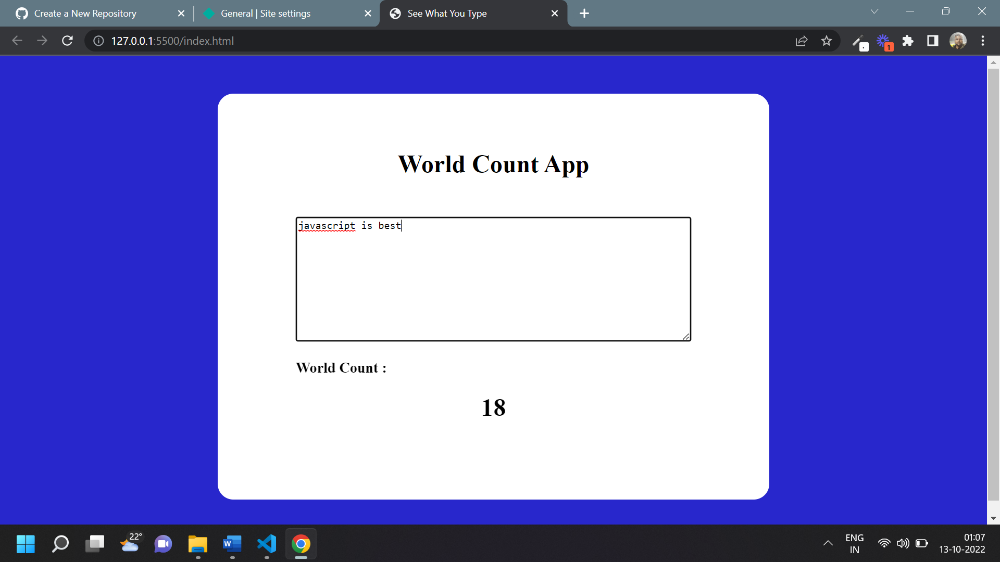

# Javascript Word count app

## Word Count App [Live Link](https://wordcounttappp.netlify.app/)

- Skills Gained in this project

  - By input event add as user input text count every charecter

---

## Time taken to finish this project

- 10 minutes to complete it

#### Screenshot

